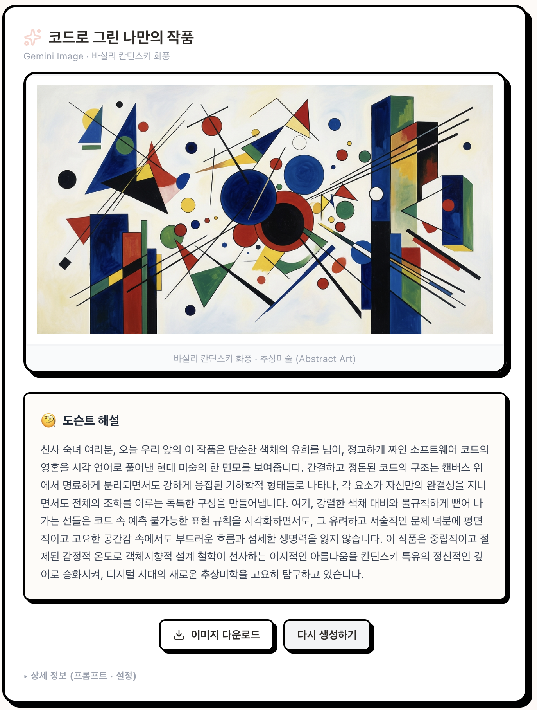
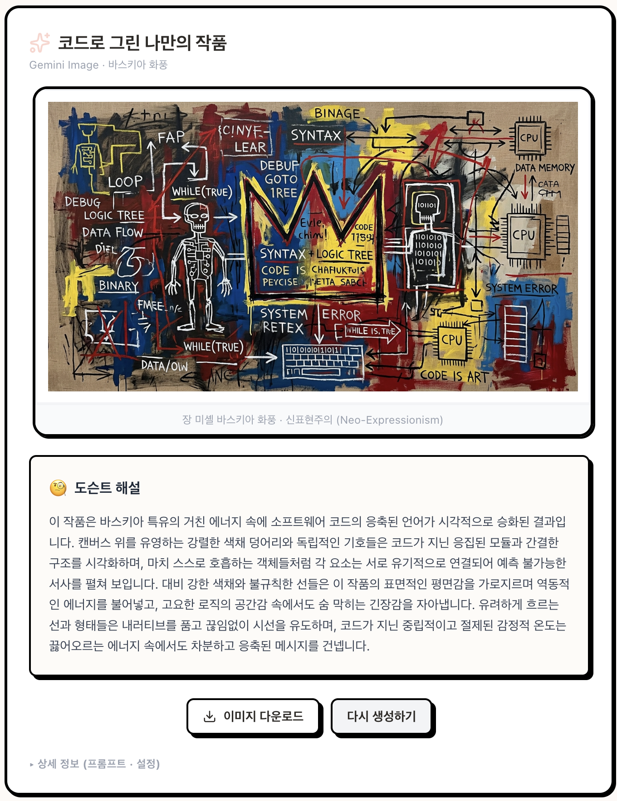
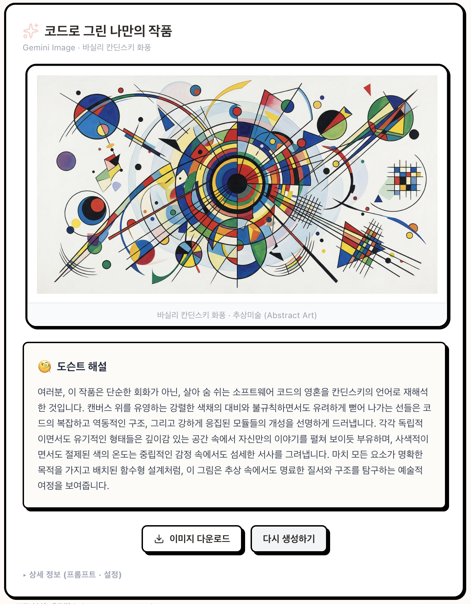
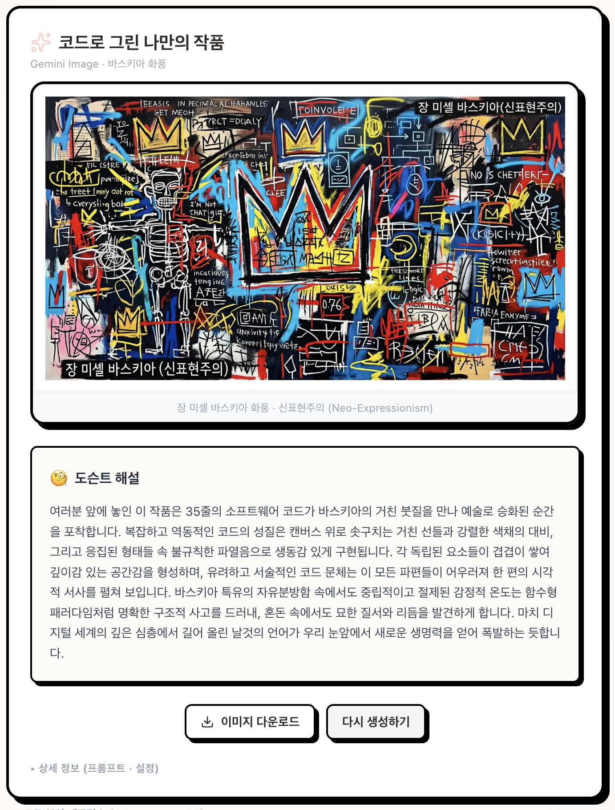

# Code2Art: Is My Code Art? 🎨✨

**Is your code ready to become art?**
Code2Art is an innovative service that analyzes the structure and logic of your code and generates high-definition abstract art reinterpreted in the styles of legendary masters.

100% Local Analysis. No server transmission. A masterpiece created just for you.

[한국어 버전 (Korean Version)](./README.md)

---

## 🚀 Key Features

### 1. Intelligent Code Analysis
- **Local AST Parsing**: Analyzes the structure of various languages (JavaScript, TypeScript, Python, Java, etc.) directly in the browser without sending code to a server.
- **8 Artistic Metrics**: Quantifies indicators such as Complexity, Cohesion, Coupling, and Readability to transform them into artistic seeds.

### 2. Masterpiece Styles
- **[Auto] AI Auto Selection**: Real-time analysis of code characteristics to automatically recommend the most suitable art style.
- **Wassily Kandinsky**: Musical composition of points, lines, and planes with precise geometric abstraction.
- **Vincent van Gogh**: Passionate swirling brushstrokes and intense emotional energy.
- **Claude Monet**: Lyrical Impressionism with shimmering light and soft, bleeding colors.
- **Salvador Dalí**: Surrealist compositions transcending space-time with exquisite detail.
- **Jean-Michel Basquiat**: Neo-Expressionism capturing raw urban energy, graffiti, and explosions of primary colors.

### 3. ArtBot & AI Docent
- **Animated ArtBot**: Features a cute robot animation showing the 3-stage process (Analysis - Painting - Appreciation) of a work's birth.
- **AI Docent Commentary**: Provides commentary from an art critic's perspective, explaining how the generated work reflects code traits like Complexity and Readability.

### 4. HD AI Rendering
- **State-of-the-art Model Integration**: Supports OpenAI's **DALL-E 3** and Google's **Gemini 3.1 Flash** to instantly generate museum-quality images.

---

## 🖼️ Demonstration

See how Code2Art sublimates code quality (metrics) into visual art.

### ✅ Good Code Artifacts (Clean & Modular)
Code with high readability and low complexity is expressed through balanced compositions and clear colors.

| Example 1 | Example 2 |
| :---: | :---: |
|  |  |

### ❌ Bad Code Artifacts (Chaos & Spaghetti)
Code with high complexity and tight coupling is expressed through destructive energy and raw, textured graffiti.

| Example 1 | Example 2 |
| :---: | :---: |
|  |  |

---

## 📦 Get Started

Run Code2Art locally and turn your own code into art.

### 1. Prerequisites
- **Node.js**: v18.0.0 or higher recommended.
- **NPM**: Automatically included with Node.js (or use Yarn/PNPM).
- **API Key**: An OpenAI (DALL-E 3) or Google Gemini API key is required for rendering.

### 2. Installation
Clone the repository and install dependencies.

```bash
# 1. Clone the repository
git clone https://github.com/inhyuk-jung/code2art.git
cd code2art

# 2. Install dependencies
npm install
```

### 3. Environment Variables - **Required**
You must create a `.env.local` file and enter the following settings. Direct manual entry in the UI has been removed.

```bash
# .env.local example
NEXT_PUBLIC_OPENAI_KEY=your_openai_api_key_here
NEXT_PUBLIC_GEMINI_KEY=your_gemini_api_key_here
```

### 4. Running Locally
Run the development server and check it in your browser.

```bash
npm run dev
```
Once the server starts, visit [http://localhost:3000](http://localhost:3000). The available model (Gemini or OpenAI) will be automatically activated based on your environment variables.

### 5. Build and Deploy
To create a production build, use the following commands:

```bash
npm run build
npm run start
```

---

## 🛠️ Test Cases

### 1. Refined Abstract Architecture (Recommended: Kandinsky / Monet)
Code showing class-based abstraction, clean interfaces, and high cohesion. Beautifully transforms into geometric, balanced Kandinsky style or soft Monet style.

```typescript
/**
 * Abstract Geometry Orchestrator
 * Generates harmonious artistic seeds through high readability and clear modularization.
 */
interface Drawable {
  draw(ctx: CanvasRenderingContext2D): void;
}

class Circle implements Drawable {
  constructor(private x: number, private y: number, private radius: number) {}
  draw(ctx: CanvasRenderingContext2D) {
    ctx.beginPath();
    ctx.arc(this.x, this.y, this.radius, 0, Math.PI * 2);
    ctx.stroke();
  }
}

export class ArtGenerativeSystem {
  private elements: Drawable[] = [];

  public addElement(element: Drawable): void {
    this.elements.push(element);
  }

  public renderAll(ctx: CanvasRenderingContext2D): void {
    console.log(`Rendering ${this.elements.length} elements with precision.`);
    this.elements.forEach(el => el.draw(ctx));
  }

  public static async main() {
    const system = new ArtGenerativeSystem();
    system.addElement(new Circle(100, 100, 50));
    system.addElement(new Circle(250, 200, 30));
    
    const context = {} as CanvasRenderingContext2D; // Mock context
    system.renderAll(context);
    return "System refinement complete.";
  }
}

// Entry point
ArtGenerativeSystem.main().then(res => console.log(res));
```

### 2. Dynamic Data Stream (Recommended: Van Gogh / Dalí)
Python example with continuous data processing logic and moderate complexity. Emphasizes rhythm and flow, matching well with Van Gogh's swirling brushwork.

```python
import math
import time

class DataStreamProcessor:
    """
    An engine for processing continuous data flows.
    Has appropriate flow (Readability) and medium complexity (Complexity).
    """
    def __init__(self, stream_id):
        self.stream_id = stream_id
        self.history = []

    def process_signal(self, raw_value):
        # Mathematical transformation creating complex but regular rhythm
        normalized = math.sin(raw_value) * math.cos(raw_value / 2)
        smoothed = (sum(self.history[-5:]) + normalized) / 6 if self.history else normalized
        
        self.history.append(smoothed)
        if len(self.history) > 100: self.history.pop(0)
        
        return f"Signal[{self.stream_id}]: {smoothed:.4f}"

    def run_pipeline(self, cycles=10):
        print(f"Starting pipeline {self.stream_id}...")
        for i in range(cycles):
            signal = self.process_signal(i * 1.5)
            print(f"Cycle {i}: {signal}")
            time.sleep(0.01)

def main():
    # Main execution: logic flow is clearly visible.
    engine = DataStreamProcessor("VORTEX_CORE")
    engine.run_pipeline(20)
    print("Stream analysis finished.")

if __name__ == "__main__":
    main()
```

### 3. Worst Chaos Source: Screams of Legacy (Recommended: Basquiat)
'Spaghetti at its finest' code with extreme complexity, low readability, and terrible cohesion. Enjoy the urban chaos and raw explosions as if the canvas itself is screaming.

```javascript
/**
 * Legendary Legacy Spaghetti Function
 * Experience the artistic explosive power of 0.95 complexity and 0.1 readability.
 */
function processUglyLegacyChaos(a, b, c, d, e, f) {
    var _0x123 = []; 
    console.log("Initializing hell version 2.0...");
    
    if (a > 10) {
        for (var i = 0; i < 100; i++) {
            if (i % 2 === 0) {
                while (b > 0) {
                    try { 
                        if (c) { 
                            b--; 
                            d.push(i + a); 
                            if (d.length > 50) {
                                (function(temp){
                                    eval("var chaos = " + temp + "; window.lastVal = chaos;");
                                })(d[0]);
                            }
                        } 
                    } catch (err) { 
                        b += 1; 
                        a *= 1.1; 
                        console.error("CRITICAL_VOID: " + err);
                    } finally { 
                        a = Math.sqrt(Math.abs(a - i)); 
                        _0x123.push(function(x){ 
                            return x * a + Math.random() + (function(y){ return y * y; })(i); 
                        });
                    }
                }
            } else {
                // Meaningless nested branches
                if (a < 5) {
                    if (b > 10) {
                        return "Early Exit Disaster";
                    }
                }
            }
        }
    } else {
        return (function(p){ 
            return p.split("").reverse().map(function(char){
                return String.fromCharCode(char.charCodeAt(0) ^ 0x42);
            }).join("");
        })("PLEASE_DECODE_THIS_PAIN_IMMEDIATELY");
    }
    
    // Aggregation of complex operations
    return _0x123.reduce((acc, fn) => acc + fn(Math.random()), 0) / (a || 1);
}

// Execution part (Unclear context)
var result = processUglyLegacyChaos(15, 10, true, [], {}, function(x){ return x > 0; });
console.log("Chaos result: " + result);
```

---

*Join the moment when your code transcends simple logic and becomes a piece of art.* ✍️✨
